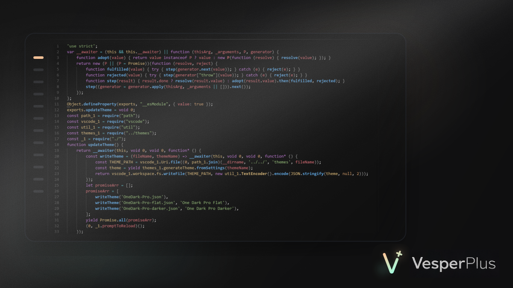

# VesperPlus

VesperPlus is a VS Code theme that keeps the original Vesper UI and combines it with a more colorful editor palette inspired by One Dark Pro.

## Features

- Original Vesper UI styling
- One Dark Pro inspired editor syntax colors and terminal ANSI palette

## Credits

VesperPlus is based on these upstream projects:

- [Vesper](https://github.com/raunofreiberg/vesper) by Rauno Freiberg
- [One Dark Pro](https://github.com/Binaryify/OneDark-Pro) by zhuangtongfa / Binaryify

## License

This repository is licensed under MIT. See `LICENSE`.

Third-party attribution is documented in `THIRD_PARTY_NOTICES.md`.
